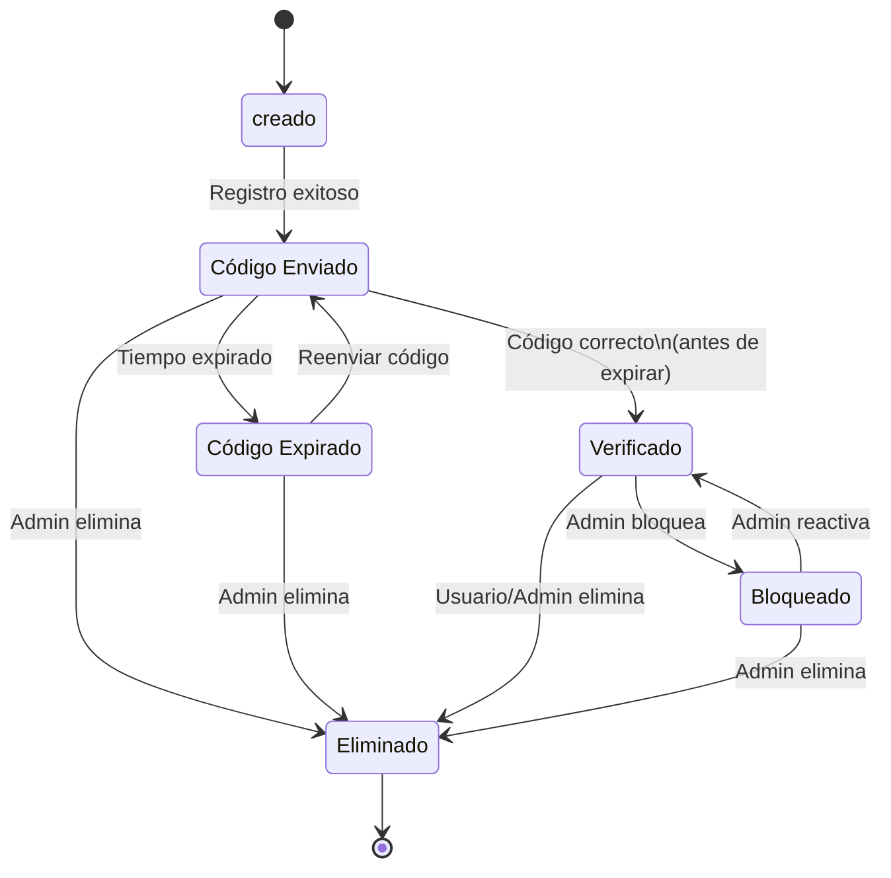
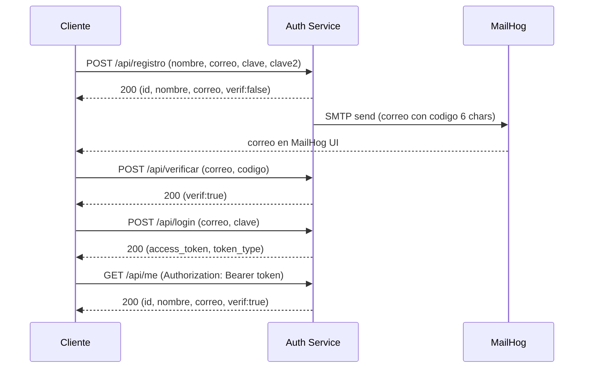

# Auth Service (Microservicio 1)

Servicio de autenticación con FastAPI + Python. Registro de usuario con verificación por correo (código de 6 caracteres), login con JWT y endpoints protegidos. Dockerizado y es testeable con MailHog.

---

## Tabla de contenidos
- Descripción
- Funcionalidades
- Tecnologías
- Requisitos
- Estructura del proyecto
- Instalación (local / Docker)
- Configuración
- Endpoints (API)
- Flujo de autenticación
- Cómo probar (Postman / curl / PowerShell / MailHog)
- Diagramas (Mermaid)
- Testing automatizado (script E2E)
- Troubleshooting
- Notas finales

---

## Descripción
Este microservicio gestiona la autenticación de usuarios: registro, verificación por correo con un código de 6 caracteres, inicio de sesión con JWT y validación del token en endpoints protegidos. 

---

## Funcionalidades
- Registro de usuarios con:
  - validación de email y nombre únicos
  - validación de contraseña (mín 8 caracteres, mayúscula, minúscula, número y símbolo)
  - confirmación de contraseña (`clave2`)
- Envío de código de 6 caracteres por correo (MailHog)
- Verificación de usuario mediante código
- Login que devuelve token JWT (Bearer)
- Endpoint `/api/me` protegido que devuelve datos del usuario
- Docker + MailHog para pruebas locales
- Archivo `data/usuarios.json` para persistencia temporal

---

## Tecnologías
- Python 3.11
- FastAPI
- Uvicorn
- passlib (Argon2)
- python-jose (JWT)
- Docker y Docker Compose
- MailHog (SMTP para pruebas)
- PowerShell / curl / Postman para pruebas

---

## Requisitos
- Docker Desktop (con `docker compose`)
- Python 3.11 si trabajas local
- pip, virtualenv si se trabaja en local
- PowerShell (Windows) o bash (Linux/macOS)

---

## Estructura del proyecto (sugerida)
```
auth-service/
├─ app/
│  ├─ main.py
│  ├─ routes.py
│  ├─ schemas.py
│  ├─ utils.py
|  ├─ models.py
|  ├─ db.py
|  ├─ config.py
│  └─ mailer.py
├─ data/
│  └─ usuarios.json
├─ docker-compose.yml
├─ Dockerfile
├─ requirements.txt
├─ test_e2e.ps1
└─ README.md
```

---

## Instalación — Local (Windows) paso a paso
1. Clonar repo:
```bash
git clone https://github.com/namoruso/distributed-system/tree/main
cd auth-service
```
2. Crear y activar un entorno virtual:
```powershell
python -m venv venv
.\venv\Scripts\activate
```
En Linux/macOS:
```bash
python -m venv venv
source venv/bin/activate
```
3. Instalar dependencias:
```bash
pip install --upgrade pip
pip install -r requirements.txt
pip install argon2-cffi
```
4. Ejecutar local:
```bash
uvicorn app.main:app --reload --host 127.0.0.1 --port 8000
```

---

## Instalación con Docker (recomendado)
1. Levantar servicios (incluye MailHog):
```bash
docker compose up -d --build
```
2. Verificar contenedores:
```bash
docker compose ps
```
3. Ver logs:
```bash
docker compose logs -f
docker compose logs auth --tail 200
```

---

## Configuración (variables)
Valores comunes (se pueden dejar por defecto):
- SMTP_HOST: `mailhog` (en docker)
- SMTP_PORT: `1025`
- JWT_SECRET: secreto para firmar tokens
- JWT_ALGO: `HS256`
- DATA_FILE: `data/usuarios.json`

En Docker se pasan por `docker-compose.yml` o `.env`. En local, se pueden definir en `app/main.py` o usar las variables de entorno.

---

## API — Endpoints principales

Base: `http://127.0.0.1:8000/api`

### Registro
**POST** `/api/registro`  
Body JSON:
```json
{
  "nombre":"juan",
  "correo":"juan@example.com",
  "clave":"Aa1!abcd",
  "clave2":"Aa1!abcd"
}
```
Posibles respuestas:
- `200` -> usuario creado `{"id":1, "nombre":"juan", "correo":"juan@example.com", "verif": false}`
- `422` -> validación de pydantic (email inválido, clave corta, etc)
- `400` -> nombre/correo duplicado o contraseña no cumple reglas

### Verificar código
**POST** `/api/verificar`  
Body JSON:
```json
{
  "correo": "juan@example.com",
  "codigo": "ABC123"
}
```
Posibles respuestas:
- `200` -> verificación exitosa (`verif:true`)
- `400` -> código inválido, expirado o ya verificado

### Login
**POST** `/api/login`  
Body JSON:
```json
{
  "correo":"juan@example.com",
  "clave":"Aa1!abcd"
}
```
Posibles respuestas:
- `200` -> `{"access_token": "...","token_type": "bearer" }`
- `400` -> credenciales inválidas o usuario no verificado

### Me (protegido)
**GET** `/api/me`  
Header:
```
Authorization: Bearer {token}
```
Respuesta:
- `200` -> `{id, nombre, correo, verif}`
- `401` -> token inválido o faltante

### Debug
**GET** `/api/debug/lista` --> da la lista completa de usuarios

---

## Flujo de autenticación (resumen)
1. Cliente POST `/api/registro` con datos.
2. Servidor valida y crea usuario con `verif=false`, genera `codigo` y envía correo.
3. Cliente copia código desde MailHog y POST `/api/verificar`.
4. Si es correcto se marca `verif=true`.
5. Cliente POST `/api/login` y recibe JWT.
6. Usa JWT en `Authorization` para acceder a endpoints protegidos.

---

## Cómo probar paso a paso

### 1) Arranca servicios:
```bash
docker compose up -d --build
```

### 2) MailHog UI:
Abrir `http://localhost:8025` para ver los correos con el código.

### 3) Registrar usuario (curl):
```bash
curl -X POST http://127.0.0.1:8000/api/registro \
  -H "Content-Type: application/json" \
  -d '{"nombre":"Maria","correo":"maria@example.com","clave":"Ab3!abdd","clave2":"Ab3!abdd"}'
```

### 4) Verificar código (copiar desde MailHog):
```bash
curl -X POST http://127.0.0.1:8000/api/verificar \
  -H "Content-Type: application/json" \
  -d '{"correo":"maria@example.com","codigo":"ABC123"}'
```

### 5) Login:
```bash
curl -X POST http://127.0.0.1:8000/api/login \
  -H "Content-Type: application/json" \
  -d '{"correo":"maria@example.com","clave":"Ab3!abdd"}'
```

### 6) /api/me:
```bash
curl -X GET http://127.0.0.1:8000/api/me \
  -H "Authorization: Bearer {ACCESS_TOKEN}"
```

### Postman/PowerShell
- En Postman:Se pueden crear requests como arriba y se usa MailHog UI para copiar el código que llega al correo
- PowerShell: usar `Invoke-RestMethod` con `-Body (ConvertTo-Json)` para evitar errores de comillas.

---

## Diagrama de Estados del Usuario 



### Diagrama de Secuencia de Autenticación



---

## Errores comunes y soluciones
- `source venv/bin/activate` falla en Windows -> se debe usar `.\venv\Scripts\activate`
- `docker-compose` no reconocido -> usar `docker compose` 
- `MissingBackendError: argon2: no backends available` -> `pip install argon2-cffi`
- Error 500 al registrar -> revisar los logs `docker compose logs auth --tail 200`
- MailHog muestra mensajes viejos -> se deben borrar mensajes `Invoke-RestMethod -Method Delete http://localhost:8025/api/v1/messages`

---


