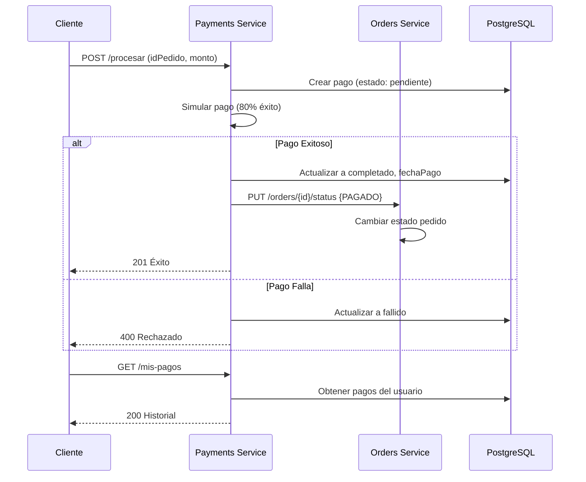
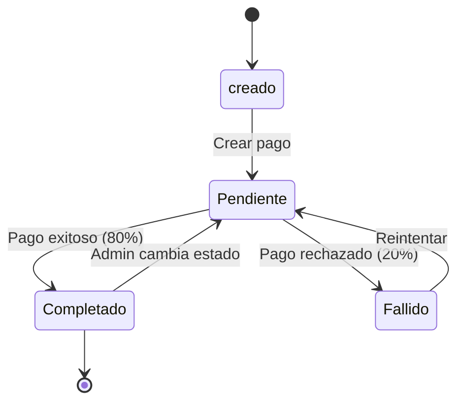

# Payments Service (Microservicio 5)

Servicio de pagos con Node.js + Express. Simula procesamiento de pagos, mantiene historial de transacciones, actualiza estados de pedidos automáticamente y validación JWT. Dockerizado.

---

## Tabla de contenidos
- Descripción
- Funcionalidades
- Tecnologías
- Requisitos
- Estructura del proyecto
- Instalación (local / Docker)
- Configuración
- Endpoints (API)
- Flujo de pagos
- Cómo probar (curl / PowerShell / Postman)
- Diagramas (Mermaid)
- Troubleshooting
- Notas finales

---

## Descripción

Este microservicio gestiona los pagos del sistema, simula el procesamiento de pagos, registra transacciones en BD, mantiene historial por usuario, valida JWT en todos los endpoints protegidos y notifica automáticamente a orders-service cuando un pago se completa para actualizar el estado del pedido.

---

## Funcionalidades

- **Simulacion de pasarela de pago** 
  - Validación de número de tarjeta con algoritmo de Luhn
  - Validación de CVV y fecha de vencimiento
  - Detección de marca de tarjeta (Visa, Mastercard, Amex, Discover)
- **Simulación de procesamiento** 
- Registro de pagos con estados: `pendiente`, `completado`, `fallido`
- Historial de pagos por usuario con paginación
- Generación de referencias únicas de transacción 
- Validación JWT en endpoints protegidos
- Servicio separado para comunicación con orders-service
- Integración automática con orders-service
- Actualización de estado de pedido al completar pago
- Estadísticas de pagos para administrador 
- Cambio manual de estado de pago (admin)
- Docker + PostgreSQL para pruebas locales
- Paginación en endpoints GET 

---

## Tecnologías

- Node.js 20+
- Express.js ^4.18.2
- PostgreSQL 16
- Sequelize ^6.35.2 (ORM)
- JWT (jsonwebtoken ^9.0.3)
- Axios ^1.6.2
- Docker y Docker Compose
- curl / PowerShell / Postman para pruebas

---

## Requisitos

- Docker Desktop (con `docker compose`)
- Node.js 20+ si trabajas local
- npm si se trabaja en local
- PowerShell (Windows) o bash (Linux/macOS)

---

## Estructura del proyecto

```
payments-service/
├─ src/
│  ├─ index.js                    
│  ├─ config/
│  │  └─ bd.js                   
│  ├─ controllers/
│  │  └─ pagoCtrl.js              
│  ├─ middleware/
│  │  └─ auth.js                  
│  ├─ models/
│  │  └─ index.js
|  |  └─ pago.js                
│  ├─ routes/
│  │  └─ pagoRutas.js             
│  ├─ services/
│  │  └─ ordenSvc.js             
│  └─ utils/
│     └─ helpers.js               
├─ .env                           
├─ .env.example                   
├─ .gitignore
├─ docker-compose.yml             
├─ Dockerfile
├─ package.json
└─ README.md                       


## Instalación Local (Windows) 

1. Clonar repo:
```bash
git clone https://github.com/namoruso/distributed-system.git
cd payments-service
```

2. Instalar dependencias:
```powershell
npm install
```

3. Crear archivo .env (copiar .env.example):
```powershell
cp .env.example .env
```

4. Asegurar que PostgreSQL corre en puerto 5432 

5. Ejecutar local:
```bash
npm run dev
```

En Linux/macOS:
```bash
npm run dev
```

---

## Instalación con Docker 

1. Crear red compartida:
```bash
docker network create sistema-distribuido
```

2. Levantar servicios:
```bash
docker compose up -d --build
```

3. Verificar contenedores:
```bash
docker compose ps
```

4. Ver logs:
```bash
docker compose logs -f payments-service
docker compose logs payments-service --tail 200
```

---

## Configuración

Valores comunes en `.env`:
- PORT: `8002`
- DB_HOST: `localhost` (local) o `payments-db` (Docker)
- DB_PORT: `5432`
- DB_NAME: `pagos_db`
- DB_USER: `postgres`
- DB_PASSWORD: `postgres`
- JWT_SECRET: secreto para validar tokens (debe coincidir con auth-service)
- ORDERS_SERVICE_URL: `http://localhost:8003/api` (local) o `http://orders-service:8003/api` (Docker)
- NODE_ENV: `development` o `production`

En Docker se pasan por `docker-compose.yml`. En local, se definen en `.env`.

---

## API — Endpoints principales

Base: `http://localhost:8002/api/pagos`

### Headers requeridos 
```
Authorization: Bearer {token_jwt}
Content-Type: application/json
```

---

### Procesar Pago

**POST** `/procesar`

Simula procesamiento de pago. Valida número de tarjeta, CVV, vencimiento. Automáticamente notifica a orders-service si el pago es exitoso.

```json
{
  "idPedido": 1,
  "monto": 150.50,
  "numTarjeta": "4111111111111111",
  "cvv": "123",
  "vencimiento": "12/25",
  "nombreTitular": "Juan Perez",
  "email": "juan@example.com"
}
```

Respuesta (201 - Pago exitoso):
```json
{
  "id": "pay_1ABC123XYZ",
  "object": "payment_intent",
  "amount": 150.50,
  "amount_received": 150.50,
  "currency": "USD",
  "status": "succeeded",
  "payment_method": {
    "last4": "1111",
    "brand": "visa",
    "card_holder": "Juan Perez"
  },
  "created": "2026-01-10T15:30:00Z",
  "charges": {
    "data": [
      {
        "id": "pay_1ABC123XYZ",
        "amount": 150.50,
        "status": "succeeded",
        "receipt_url": "https://api.example.com/receipts/pay_1ABC123XYZ"
      }
    ]
  },
  "metadata": {
    "order_id": 1,
    "user_id": 5
  }
}
```

Respuesta (402 - Pago rechazado):
```json
{
  "object": "error",
  "type": "card_error",
  "code": "card_declined",
  "message": "Su tarjeta fue rechazada. Intente con otro método de pago.",
  "decline_code": "insufficient_funds",
  "payment_intent": "pay_xxxxx"
}
```

**Errores de validación (400):**
- Número de tarjeta inválido (no pasa validación Luhn)
- CVV inválido (debe ser 3 o 4 dígitos según marca)
- Fecha de vencimiento inválida o vencida
- Datos incompletos

**Tarjetas de prueba:**
- `4111111111111111` → Visa (éxito)
- `5555555555554444` → Mastercard (siempre rechazada)
- `4000000000000002` → Visa (siempre rechazada)

---

### Ver Mis Pagos

**GET** `/mis-pagos?page=1&limit=10`

Lista todos los pagos del usuario autenticado con paginación (ordenados por fecha descendente).

Respuesta (200):
```json
{
  "pagos": [
    {
      "id": "uuid-1",
      "idPedido": 1,
      "monto": 150.50,
      "estado": "completado",
      "referencia": "PAG-XYZABC",
      "fechaPago": "2026-01-10T15:30:00Z",
      "createdAt": "2026-01-10T15:30:00Z"
    }
  ],
  "paginacion": {
    "total": 25,
    "pagina": 1,
    "limite": 10,
    "totalPaginas": 3,
    "tieneSiguiente": true,
    "tieneAnterior": false
  }
}
```

---

### Ver Pago Específico

**GET** `/{id}`

Obtiene detalles de un pago (solo si pertenece al usuario).

Respuesta (200):
```json
{
  "id": "uuid-aqui",
  "idPedido": 1,
  "idUsuario": 5,
  "monto": 150.50,
  "estado": "completado",
  "metodo": "tarjeta",
  "referencia": "PAG-XYZABC",
  "fechaPago": "2026-01-10T15:30:00Z",
  "createdAt": "2026-01-10T15:30:00Z"
}
```

---

### Ver Estadísticas (Admin)

**GET** `/estadisticas`

Obtiene resumen de pagos (acceso solo con token JWT válido).

Respuesta (200):
```json
{
  "resumen": {
    "totalPagos": 45,
    "completados": 35,
    "pendientes": 7,
    "fallidos": 3
  },
  "montos": {
    "total": 5420.50,
    "completado": 5200.00
  },
  "tasaExito": "77.78%"
}
```

---

### Ver Pagos de un Pedido

**GET** `/pedido/{idPedido}?page=1&limit=10`

Obtiene todos los pagos de un pedido específico (sin protección JWT).

Respuesta (200):
```json
{
  "pagos": [ ... ],
  "paginacion": {
    "total": 1,
    "pagina": 1,
    "limite": 10,
    "totalPaginas": 1,
    "tieneSiguiente": false,
    "tieneAnterior": false
  }
}
```

---

### Actualizar Estado de Pago (Admin)

**PUT** `/{id}`

Cambia el estado de un pago pendiente → completado → fallido. Si cambia a completado, notifica automáticamente a orders-service.

Body JSON:
```json
{
  "estado": "completado"
}
```

Estados válidos: `pendiente`, `completado`, `fallido`

Respuesta (200):
```json
{
  "id": "pay_xxxxx",
  "object": "charge",
  "status": "succeeded",
  "amount": 150.50,
  "currency": "USD",
  "payment_method": {
    "last4": "1111",
    "brand": "visa"
  },
  "paid": true,
  "updated": "2026-01-10T15:35:00Z"
}
```

---

## Flujo de pagos 

1. Cliente hace un pedido en orders-service (estado: CREADO)
2. Cliente procesa pago → **POST** `/api/pagos/procesar`
3. Payments simula pago:
   - Si **exitoso**: estado = `completado`, notifica a orders y el estado del pedido cambia a `PAGADO`
   - Si **falla**: estado = `fallido`, el pedido se queda en `CREADO`
4. Cliente puede reintentar o pagar nuevo
5. Cliente ve historial de pagos con **GET** `/api/pagos/mis-pagos`
6. Admin ve estadísticas con **GET** `/api/pagos/estadisticas`
7. Admin puede cambiar estado manualmente usando **PUT** `/{id}`

---

## Cómo probar paso a paso

### 1) Arranca servicios:
```bash
docker compose up -d --build
```

### 2) Health check:
```bash
curl http://localhost:8002/health
```

### 3) Obtener token (desde auth-service):
```bash
curl -X POST http://127.0.0.1:8000/api/login \
  -H "Content-Type: application/json" \
  -d '{"correo":"usuario@example.com","clave":"Aa1!abcd"}'
```

Debes copiar el `access_token` de la respuesta.

### 4) Procesar pago con datos realistas:

**Pago exitoso (Visa válida):**
```bash
curl -X POST http://localhost:8002/api/pagos/procesar \
  -H "Authorization: Bearer {ACCESS_TOKEN}" \
  -H "Content-Type: application/json" \
  -d '{
    "idPedido": 1,
    "monto": 150.50,
    "numTarjeta": "4111111111111111",
    "cvv": "123",
    "vencimiento": "12/25",
    "nombreTitular": "Juan Perez",
    "email": "juan@example.com"
  }'
```

**Pago rechazado (Mastercard decline):**
```bash
curl -X POST http://localhost:8002/api/pagos/procesar \
  -H "Authorization: Bearer {ACCESS_TOKEN}" \
  -H "Content-Type: application/json" \
  -d '{
    "idPedido": 2,
    "monto": 200.00,
    "numTarjeta": "5555555555554444",
    "cvv": "456",
    "vencimiento": "06/26",
    "nombreTitular": "Maria Lopez",
    "email": "maria@example.com"
  }'
```

**Tarjeta expirada (error de validación):**
```bash
curl -X POST http://localhost:8002/api/pagos/procesar \
  -H "Authorization: Bearer {ACCESS_TOKEN}" \
  -H "Content-Type: application/json" \
  -d '{
    "idPedido": 3,
    "monto": 99.99,
    "numTarjeta": "4111111111111111",
    "cvv": "123",
    "vencimiento": "01/24",
    "nombreTitular": "Carlos Rodriguez"
  }'
```

### 5) Ver mis pagos:
```bash
curl -X GET http://localhost:8002/api/pagos/mis-pagos \
  -H "Authorization: Bearer {ACCESS_TOKEN}"
```

### 6) Ver estadísticas:
```bash
curl -X GET http://localhost:8002/api/pagos/estadisticas \
  -H "Authorization: Bearer {ACCESS_TOKEN}"
```

### PowerShell

Procesar pago:
```powershell
$token = "tu_token_aqui"
$headers = @{Authorization = "Bearer $token"; "Content-Type" = "application/json"}
$body = @{idPedido = 1; monto = 150.50; metodo = "tarjeta"} | ConvertTo-Json

Invoke-RestMethod `
  -Uri http://localhost:8002/api/pagos/procesar `
  -Method Post -Headers $headers -Body $body
```

Ver mis pagos:
```powershell
Invoke-RestMethod `
  -Uri http://localhost:8002/api/pagos/mis-pagos `
  -Method Get -Headers $headers | ConvertTo-Json
```

---

## Diagrama de Flujo de Pagos



---

## Diagrama de Estados de Pago



---

## Errores comunes y soluciones

- `npm install` falla con error jsonwebtoken, ante esto se debe usar versión `^9.0.3`que ya esta corregida en package.json
- Ante`Cannot connect to database` se debe verificar PostgreSQL en puerto 5432 o usar Docker
- `Token inválido`, el token debe venir de auth-service, verificar que JWT_SECRET es el mismo
- `Orders no se actualiza`, se debe verificar ORDERS_SERVICE_URL en .env coincide con puerto real de orders
- Si sale puerto 8002 ocupado se debe cambiar PORT en .env a otro número
- `docker-compose` no reconocido, ante esto se debe usar `docker compose` 

---


